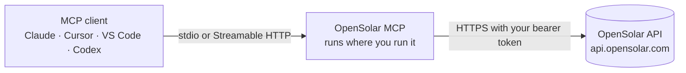

<div align="center">

# OpenSolar MCP

**Give Claude, Cursor, VS Code, and any other MCP client safe, structured access to your OpenSolar organisation.**

Unofficial · Self-hosted · Bring your own OpenSolar API token

[](https://www.npmjs.com/package/@alignco/opensolar-mcp)
[](https://github.com/Align-Software-Company/opensolar-mcp/actions/workflows/ci.yml)
[](https://modelcontextprotocol.io/specification/2026-07-28)
[](https://nodejs.org/)
[](LICENSE)

[Quick start](#quick-start) · [Connect a client](#connect-your-mcp-client) · [Tools](#tools) · [Configuration](#configuration) · [Remote deployment](#remote-deployment) · [Security](#security-model) · [Troubleshooting](#troubleshooting)

</div>

---

OpenSolar MCP is a [Model Context Protocol](https://modelcontextprotocol.io/) server for the documented [OpenSolar API](https://developers.opensolar.com/api/). It runs on your machine or your infrastructure, uses your own OpenSolar credentials, and gives AI agents a curated set of tools for projects, contacts, systems, files, commercial settings, and Teams sharing.



> [!IMPORTANT]
> This project is not affiliated with, endorsed by, or maintained by OpenSolar Pty Ltd. It calls only the public, documented OpenSolar API and does not operate a shared or hosted OpenSolar service.

## Highlights

- **Curated for agents.** A 31-tool default profile covers everyday work. All 75 registered tools are one setting away.
- **Semantic operations, not just endpoints.** Project and contact search, operational snapshots, stage changes by name, side-by-side system comparison, design summaries, and a read-only share preflight.
- **Conservative by design.** Searches report whether a match is `unique`, `ambiguous`, or `incomplete`, and agents are told not to guess. Writes are never retried automatically, and read-only mode removes every mutation.
- **Faithful to OpenSolar's documentation.** Every tool is backed by the official API documentation or by recorded live verification, and writes are exposed only when their request body is established. The evidence for each tool is in the [API contract matrix](docs/api-contract-matrix.md).
- **Clean model context.** Structured output with published schemas. Credentials, signed URLs, design blobs, and other raw or sensitive fields are removed before they reach the model.
- **Current MCP.** Built on the official MCP TypeScript SDK v2 for the 2026-07-28 specification, with fallback for clients on earlier protocol versions. Supports stdio and stateless Streamable HTTP, and every tool declares a title, output schema, and behavior annotations.

## What you can ask

| Ask your agent… | What happens |
| --- | --- |
| "Find the Harbour Street project and summarise where it's at." | `search_projects` finds the project, then `get_project_snapshot` reads its workflow stage, systems, and files. |
| "Compare the system options on that project." | `compare_project_systems` lines up size, annual output, price, price per watt, and hardware without ranking them. |
| "Move it to Installing." | `update_project_stage` resolves the stage name on the project's workflow and refuses ambiguous or archived matches. |
| "What's the payback and NPV on the proposal?" | `get_proposal_data` returns payback year, NPV, IRR, and ROI. Requires Raw Data API Access. |
| "Add Jordan Lee as a contact, unless they already exist." | `search_contacts` checks for existing matches first, then `create_contact` adds the person. |
| "Generate the proposal PDF for that project." | `generate_project_document` has OpenSolar save the document as a private file and returns the file ID. |
| "Can we share this project with our installer partner?" | `preflight_project_share` checks the connection and shared entities without changing anything. |

## Quick start

**Requirements**

- Node.js **24 or newer**
- An OpenSolar organisation with [API Access](https://developers.opensolar.com/api/api-access-plans/) enabled
- Your OpenSolar organisation ID and a [bearer token](https://developers.opensolar.com/api/getting-bearer-tokens/)
- [Raw Data API Access](https://developers.opensolar.com/api/api-access-plans/) only if you want `get_proposal_data` or `get_project_design`

> [!TIP]
> Standard OpenSolar user tokens expire after seven days. For a long-running setup, create a dedicated OpenSolar user for API work and [make it a machine user](https://developers.opensolar.com/api/how-to-set-machine-user/), whose token does not expire. This server never changes that setting for you.

**1. See the tools you'll get** (no credentials needed):

```bash
npx -y @alignco/opensolar-mcp --list-tools
```

**2. Check your configuration and token:**

```bash
OPENSOLAR_API_TOKEN=your_token OPENSOLAR_ORG_ID=12345 \
  npx -y @alignco/opensolar-mcp --check
```

`--check` makes one read of your organisation. Add `--no-probe` to validate the configuration without contacting OpenSolar.

**3. Add it to your MCP client** using one of the options below.

## Connect your MCP client

[](https://vscode.dev/redirect/mcp/install?name=opensolar&inputs=%5B%7B%22type%22%3A%22promptString%22%2C%22id%22%3A%22opensolar_api_token%22%2C%22description%22%3A%22OpenSolar%20API%20token%22%2C%22password%22%3Atrue%7D%2C%7B%22type%22%3A%22promptString%22%2C%22id%22%3A%22opensolar_org_id%22%2C%22description%22%3A%22OpenSolar%20organisation%20ID%22%7D%5D&config=%7B%22type%22%3A%22stdio%22%2C%22command%22%3A%22npx%22%2C%22args%22%3A%5B%22-y%22%2C%22%40alignco%2Fopensolar-mcp%22%5D%2C%22env%22%3A%7B%22OPENSOLAR_API_TOKEN%22%3A%22%24%7Binput%3Aopensolar_api_token%7D%22%2C%22OPENSOLAR_ORG_ID%22%3A%22%24%7Binput%3Aopensolar_org_id%7D%22%7D%7D)
[](https://cursor.com/install-mcp?name=opensolar&config=eyJjb21tYW5kIjoibnB4IiwiYXJncyI6WyIteSIsIkBhbGlnbmNvL29wZW5zb2xhci1tY3AiXSwiZW52Ijp7Ik9QRU5TT0xBUl9BUElfVE9LRU4iOiJ5b3VyX3Rva2VuIiwiT1BFTlNPTEFSX09SR19JRCI6IjEyMzQ1In19)

Every client needs the same two settings: `OPENSOLAR_API_TOKEN` and `OPENSOLAR_ORG_ID`. Replace `your_token` and `12345` below with your own values.

<details>
<summary><strong>Claude Code</strong></summary>

```bash
claude mcp add opensolar \
  -e OPENSOLAR_API_TOKEN=your_token \
  -e OPENSOLAR_ORG_ID=12345 \
  -- npx -y @alignco/opensolar-mcp
```

Add `--scope user` to make it available in every project.

</details>

<details>
<summary><strong>Claude Desktop</strong></summary>

Open **Settings → Developer → Edit Config** and add:

```json
{
  "mcpServers": {
    "opensolar": {
      "command": "npx",
      "args": ["-y", "@alignco/opensolar-mcp"],
      "env": {
        "OPENSOLAR_API_TOKEN": "your_token",
        "OPENSOLAR_ORG_ID": "12345"
      }
    }
  }
}
```

Restart Claude Desktop after saving.

</details>

<details>
<summary><strong>Cursor</strong></summary>

Use the **Add to Cursor** button above, or add this to `~/.cursor/mcp.json` (all projects) or `.cursor/mcp.json` (one project):

```json
{
  "mcpServers": {
    "opensolar": {
      "command": "npx",
      "args": ["-y", "@alignco/opensolar-mcp"],
      "env": {
        "OPENSOLAR_API_TOKEN": "your_token",
        "OPENSOLAR_ORG_ID": "12345"
      }
    }
  }
}
```

</details>

<details>
<summary><strong>VS Code</strong></summary>

Use the **Install in VS Code** button above, or add this to `.vscode/mcp.json`. VS Code prompts for the token and stores it securely:

```json
{
  "inputs": [
    {
      "type": "promptString",
      "id": "opensolar_api_token",
      "description": "OpenSolar API token",
      "password": true
    },
    {
      "type": "promptString",
      "id": "opensolar_org_id",
      "description": "OpenSolar organisation ID"
    }
  ],
  "servers": {
    "opensolar": {
      "type": "stdio",
      "command": "npx",
      "args": ["-y", "@alignco/opensolar-mcp"],
      "env": {
        "OPENSOLAR_API_TOKEN": "${input:opensolar_api_token}",
        "OPENSOLAR_ORG_ID": "${input:opensolar_org_id}"
      }
    }
  }
}
```

</details>

<details>
<summary><strong>Windsurf</strong></summary>

Add this to `~/.codeium/windsurf/mcp_config.json`:

```json
{
  "mcpServers": {
    "opensolar": {
      "command": "npx",
      "args": ["-y", "@alignco/opensolar-mcp"],
      "env": {
        "OPENSOLAR_API_TOKEN": "your_token",
        "OPENSOLAR_ORG_ID": "12345"
      }
    }
  }
}
```

</details>

<details>
<summary><strong>OpenAI Codex</strong></summary>

Add this to `~/.codex/config.toml`:

```toml
[mcp_servers.opensolar]
command = "npx"
args = ["-y", "@alignco/opensolar-mcp"]
env = { OPENSOLAR_API_TOKEN = "your_token", OPENSOLAR_ORG_ID = "12345" }
```

</details>

<details>
<summary><strong>Gemini CLI</strong></summary>

Add this to `~/.gemini/settings.json`:

```json
{
  "mcpServers": {
    "opensolar": {
      "command": "npx",
      "args": ["-y", "@alignco/opensolar-mcp"],
      "env": {
        "OPENSOLAR_API_TOKEN": "your_token",
        "OPENSOLAR_ORG_ID": "12345"
      }
    }
  }
}
```

</details>

<details>
<summary><strong>Any other MCP client</strong></summary>

Run `npx -y @alignco/opensolar-mcp` as a stdio server with `OPENSOLAR_API_TOKEN` and `OPENSOLAR_ORG_ID` in its environment. For a client that connects over HTTP, see [Remote deployment](#remote-deployment).

To install the command once instead of through `npx`:

```bash
npm install -g @alignco/opensolar-mcp
opensolar-mcp --version
```

</details>

> [!TIP]
> Start with `OPENSOLAR_READ_ONLY=1` in the `env` block while you get comfortable. It removes every tool that can change OpenSolar data.

## Tools

### Profiles

A **profile** is a curated operating surface. **Toolsets** are functional areas you can select directly. Read-only mode and the access-plan filter apply on top of either.

| Surface | Tools | Use it for |
| --- | ---: | --- |
| `agent` (default) | 31 | Everyday project, contact, system, file, and sharing work |
| `agent` + `OPENSOLAR_READ_ONLY=1` | 22 | Research, reporting, and trying things out safely |
| `agent` + `OPENSOLAR_PLAN=api_access` | 29 | Organisations without Raw Data API Access |
| `full` | 75 | Administration: component catalogs, workflows, webhooks, deletes, and Teams setup |

`--list-tools` always prints the exact surface your settings produce:

```bash
npx -y @alignco/opensolar-mcp --list-tools
OPENSOLAR_PROFILE=full npx -y @alignco/opensolar-mcp --list-tools
OPENSOLAR_TOOLSETS=webhooks npx -y @alignco/opensolar-mcp --list-tools
```

### Default `agent` tools

✏️ marks tools that change OpenSolar data. 🔒 marks tools that need Raw Data API Access.

| Area | Tools |
| --- | --- |
| Projects | `search_projects` · `list_projects` · `get_project` · `get_project_snapshot` · `create_project` ✏️ · `update_project` ✏️ · `update_project_stage` ✏️ · `update_project_usage` ✏️ |
| Contacts | `search_contacts` · `list_contacts` · `get_contact` · `create_contact` ✏️ · `update_contact` ✏️ |
| Organisation | `get_org` · `list_roles` |
| Systems | `compare_project_systems` · `get_system_details` |
| Commercial | `list_payment_options` · `list_pricing_schemes` · `list_costings` |
| Files & documents | `list_private_files` · `get_private_file` · `create_private_file` ✏️ · `generate_project_document` ✏️ |
| Reference | `list_roof_types` · `list_file_tags` |
| Teams sharing | `list_connected_orgs` · `preflight_project_share` · `share_entities` ✏️ |
| Raw Data | `get_proposal_data` 🔒 · `get_project_design` 🔒 |

<details>
<summary><strong>All 75 tools by toolset</strong></summary>

Set `OPENSOLAR_PROFILE=full` to expose everything, or name toolsets with `OPENSOLAR_TOOLSETS` (for example `projects,contacts,systems`).

| Toolset | Tools |
| --- | --- |
| `projects` | `list_projects`, `search_projects`, `get_project`, `get_project_snapshot`, `create_project`, `update_project`, `update_project_stage`, `update_project_usage`, `delete_project` |
| `org` | `get_org`, `list_roles`, `get_role` |
| `contacts` | `list_contacts`, `search_contacts`, `get_contact`, `create_contact`, `update_contact`, `delete_contact` |
| `events` | `get_event`, `list_event_types` |
| `systems` | `list_project_systems`, `compare_project_systems`, `get_system`, `get_system_details`, `get_system_image` |
| `components` | `list_modules`, `get_module`, `delete_module_activation`, `list_inverters`, `get_inverter`, `delete_inverter_activation`, `list_batteries`, `get_battery`, `delete_battery_activation`, `list_other_components`, `get_other_component`, `delete_other_component_activation` |
| `workflow` | `list_workflows`, `get_workflow`, `create_workflow`, `delete_workflow` |
| `payment` | `list_payment_options`, `get_payment_option`, `delete_payment_option` |
| `pricing` | `list_pricing_schemes`, `get_pricing_scheme`, `delete_pricing_scheme` |
| `costing` | `list_costings`, `get_costing`, `delete_costing` |
| `reference` | `list_roof_types`, `list_file_tags` |
| `files` | `list_private_files`, `get_private_file`, `create_private_file`, `update_private_file`, `delete_private_file`, `generate_project_document` |
| `webhooks` | `list_webhooks`, `create_webhook`, `update_webhook`, `list_webhook_logs`, `list_webhook_queue` |
| `teams` | `list_connected_orgs`, `preflight_project_share`, `list_connection_requests`, `create_connection_request`, `accept_connection_request`, `update_connection`, `delete_connection`, `share_project`, `share_entities`, `create_permission_role` |
| `raw_data` | `get_proposal_data`, `get_project_design` |

</details>

Some documented OpenSolar operations are intentionally **not** exposed because the documentation does not establish their request body — for example creating pricing schemes, payment options, costings, or component activations, and updating workflows or the organisation. The [current implementation](docs/current-state.md#unsupported-write-contracts) lists them.

## Configuration

| Variable | Purpose | Default |
| --- | --- | --- |
| `OPENSOLAR_API_TOKEN` | OpenSolar bearer token. Required for stdio and `--check`. Loopback HTTP can use it as a fallback. | — |
| `OPENSOLAR_ORG_ID` | Your OpenSolar organisation ID. | required |
| `OPENSOLAR_BASE_URL` | OpenSolar API base URL. | `https://api.opensolar.com/api/` |
| `OPENSOLAR_PROFILE` | Tool profile: `agent` or `full`. | `agent` |
| `OPENSOLAR_TOOLSETS` | Comma-separated toolsets. Replaces the profile's selection when set. | unset |
| `OPENSOLAR_READ_ONLY` | `1`, `true`, `yes`, or `on` hides every mutation. `0`, `false`, `no`, or `off` keeps them. Any other value stops startup. | off |
| `OPENSOLAR_PLAN` | `api_access` hides tools that need Raw Data API Access; `raw_data` keeps them. | unset |
| `OPENSOLAR_UPLOAD_ROOT` | Directory `create_private_file` may read from. Uploads are disabled when unset. | unset |
| `MCP_TRANSPORT` | `http` serves Streamable HTTP instead of stdio. | stdio |
| `MCP_HTTP_HOST` | HTTP bind address. | `127.0.0.1` |
| `MCP_HTTP_PORT` | HTTP port. | `3000` |
| `MCP_HTTP_PATH` | MCP endpoint path. | `/mcp` |
| `MCP_HTTP_ALLOWED_HOSTS` | Comma-separated `Host` values accepted on non-loopback binds. Required for `0.0.0.0` and `::`. | unset |
| `MCP_HTTP_ALLOWED_ORIGINS` | Browser `Origin` hostnames accepted on non-loopback binds. Requests without an `Origin` header still pass. | the Host allowlist |

`OPENSOLAR_TOOLSETS` takes precedence over the profile. `OPENSOLAR_READ_ONLY` and `OPENSOLAR_PLAN` are applied afterwards. See [`.env.example`](.env.example) for a commented template; the server itself does not load `.env` files.

<details>
<summary><strong>Command-line options</strong></summary>

| Option | Description |
| --- | --- |
| *(none)* | Serve MCP over stdio |
| `--http` | Serve MCP over Streamable HTTP |
| `--host <host>`, `--port <port>`, `--path <path>` | HTTP bind settings (override the `MCP_HTTP_*` variables) |
| `--check` | Validate configuration and make one read of your organisation |
| `--check --no-probe` | Validate configuration without contacting OpenSolar |
| `--list-tools` | Print the tool names your settings expose |
| `--version`, `-v` | Print the package version |
| `--help`, `-h` | Show help |

</details>

### Local file uploads

`create_private_file` uploads a file from the machine running the server, so it is off by default. To enable it, point it at a directory:

```bash
export OPENSOLAR_UPLOAD_ROOT=/absolute/path/to/uploads
```

Relative paths resolve inside that directory. Absolute paths and symlinks are accepted only when their real path stays inside it. The model never sends file bytes.

Downloads through `get_private_file` and `get_system_image` are capped at 10 MB. Text content is returned to the model; images and other binary files are returned as MCP image or resource content rather than copied into JSON.

## Remote deployment

The server also speaks stateless [Streamable HTTP](https://modelcontextprotocol.io/specification/2026-07-28/basic/transports), for clients that connect over the network.

```bash
OPENSOLAR_API_TOKEN=your_token OPENSOLAR_ORG_ID=12345 \
  npx -y @alignco/opensolar-mcp --http
```

| Endpoint | Purpose |
| --- | --- |
| `http://127.0.0.1:3000/mcp` | MCP |
| `/health` | Liveness. Returns `{"status":"ok"}`; no credentials required. |
| `/ready` | Readiness. Returns `{"status":"ready"}`; no credentials required. |

On a loopback address, an `Authorization: Bearer <token>` header takes precedence and the `OPENSOLAR_API_TOKEN` variable is a local fallback.

### Exposing it beyond localhost

Any non-loopback bind **requires the OpenSolar bearer token on every MCP request**. The `OPENSOLAR_API_TOKEN` variable is ignored as a fallback, and a malformed `Authorization` header is rejected.

```bash
export OPENSOLAR_ORG_ID=12345
export MCP_HTTP_HOST=0.0.0.0
export MCP_HTTP_ALLOWED_HOSTS=mcp.example.com
npx -y @alignco/opensolar-mcp --http
```

Connect a client with the token in the request header, for example:

```bash
claude mcp add --transport http opensolar https://mcp.example.com/mcp \
  --header "Authorization: Bearer your_token"
```

> [!WARNING]
> The built-in server speaks plain HTTP. Put it behind a reverse proxy or platform that terminates TLS before any token crosses a network. `MCP_HTTP_ALLOWED_HOSTS` and `MCP_HTTP_ALLOWED_ORIGINS` protect against DNS rebinding and cross-site browser requests; they are not authentication.

### Docker

The image runs the HTTP transport as an unprivileged user and includes a health check. Build it from a clone of this repository:

```bash
docker build -t opensolar-mcp .
docker run --rm \
  -e OPENSOLAR_ORG_ID=12345 \
  -p 127.0.0.1:3000:3000 \
  opensolar-mcp
```

Inside the container the server binds to `0.0.0.0`, so clients must send `Authorization: Bearer <token>` on every request. The image allows `localhost` and `127.0.0.1` as Host values; set `MCP_HTTP_ALLOWED_HOSTS` to your public hostname for anything else.

## Security model

- **Your credentials, your process.** Tokens stay in your environment or your client's configuration. Nothing is persisted, and this project runs no hosted service.
- **Writes are explicit.** Mutating tools carry MCP `readOnlyHint: false` annotations, destructive ones carry `destructiveHint: true`, and none are retried automatically. `OPENSOLAR_READ_ONLY=1` removes them entirely.
- **No guessing.** Only a search result with `resolution: unique` confirms a target, and the server instructions tell agents not to loop mutations to simulate bulk operations.
- **Minimal output.** Signed download URLs, integration secrets, webhook secrets, personal identity fields, and raw design data are redacted or omitted.
- **Bounded work.** Searches, downloads, and Raw Data decompression all have fixed limits. Only ordinary reads retry, and only on HTTP 429, up to three attempts.
- **HTTP mode passes your OpenSolar token through.** The bearer token a client sends is the OpenSolar token itself, forwarded to OpenSolar. It is not an MCP OAuth token. If several people share one deployment, put an authenticating gateway in front of it.

Please report vulnerabilities privately — see [SECURITY.md](SECURITY.md).

## Compatibility

| | |
| --- | --- |
| MCP protocol | 2026-07-28, with fallback for clients on 2025-11-25, 2025-06-18, and earlier revisions |
| Transports | stdio; stateless Streamable HTTP |
| Tool results | `structuredContent` that matches each tool's `outputSchema`, plus a short text summary and compact JSON text for compatibility |
| Runtime | Node.js 24+, ESM |

Successful structured tool results also include the same payload serialized as compact JSON text. Clients that do not forward `structuredContent` can therefore still pass the complete structured result to the model.

## Troubleshooting

| Symptom | What to do |
| --- | --- |
| `Token missing or expired` | Standard tokens expire after seven days. Get a new token, or use a [machine user](https://developers.opensolar.com/api/how-to-set-machine-user/). |
| `This call needs Raw Data API Access` | Enable Raw Data API Access in OpenSolar, or set `OPENSOLAR_PLAN=api_access` to hide those tools. |
| `The caller cannot use this record` (HTTP 403) | The token's user lacks permission, or the project is outside your API Access entitlement. |
| `Throttled. Wait. Do not loop` (HTTP 429) | You hit an OpenSolar [throttle limit](https://developers.opensolar.com/api/throttle/). Wait before retrying. |
| A tool you expect is missing | Run with `--list-tools` using the same environment and check `OPENSOLAR_PROFILE`, `OPENSOLAR_TOOLSETS`, `OPENSOLAR_READ_ONLY`, and `OPENSOLAR_PLAN`. |
| `Unknown OPENSOLAR_READ_ONLY` at startup | Use `1`/`true`/`yes`/`on` or `0`/`false`/`no`/`off`. Anything else is refused so a typo can't expose writes. |
| The server won't start from your client | Check `node --version` is 24 or newer on the `PATH` your client uses. On Windows, some clients need `"command": "cmd"` with `"args": ["/c", "npx", "-y", "@alignco/opensolar-mcp"]`. |
| HTTP returns `401 Unauthorized` | Non-loopback binds ignore `OPENSOLAR_API_TOKEN`; send `Authorization: Bearer <token>` with every request. |
| HTTP returns `403` before reaching MCP | Add your hostname to `MCP_HTTP_ALLOWED_HOSTS`, or the browser origin to `MCP_HTTP_ALLOWED_ORIGINS`. |

Logs go to stderr as JSON lines, so stdout stays clean for the MCP protocol.

## Development

```bash
git clone https://github.com/Align-Software-Company/opensolar-mcp.git
cd opensolar-mcp
corepack enable
pnpm install --frozen-lockfile
pnpm check:all      # repository hygiene, registry metadata, lint, typecheck, offline tests
pnpm build
pnpm test:docker    # build and smoke-test the Docker image
```

The regular test suite runs offline. Live integration tests read `.env.local` and run read-only by default; writes need `OPENSOLAR_INTEGRATION_WRITES=1` and dedicated fixture records:

```bash
pnpm test:integration
OPENSOLAR_INTEGRATION_WRITES=1 pnpm test:integration
```

Read [CONTRIBUTING.md](CONTRIBUTING.md) before opening a pull request, especially the rules for OpenSolar API evidence.

## Documentation

| Document | What's in it |
| --- | --- |
| [Current implementation](docs/current-state.md) | Shipped behavior: exposure rules, transports, client behavior, redaction, and limits |
| [API contract matrix](docs/api-contract-matrix.md) | Endpoint, method, parameters, plan, throttle, and evidence for every tool |
| [API quirks](docs/api-quirks.md) | OpenSolar behavior that surprised us, and how the server handles it |
| [Source log](docs/source-log.md) | Documentation pages and live checks behind each contract |
| [Default profile evaluation](docs/agent-profile-evaluation.md) | Behavioral evaluation of the default profile and its release adjustment |
| [Release constraints](docs/terms-release-gate.md) | OpenSolar terms, throttles, and access plans that affect deployment |
| [Release checklist](docs/release-checklist.md) | The release gate |
| [Changelog](CHANGELOG.md) | Notable changes by version |

## Contributing

Contributions are welcome. See [CONTRIBUTING.md](CONTRIBUTING.md) and the [Code of Conduct](CODE_OF_CONDUCT.md). For security issues, follow [SECURITY.md](SECURITY.md) instead of opening an issue.

## License

[MIT](LICENSE) © 2026 Align Software Company.

OpenSolar is a trademark of OpenSolar Pty Ltd. This project is independent and is not endorsed by OpenSolar.
